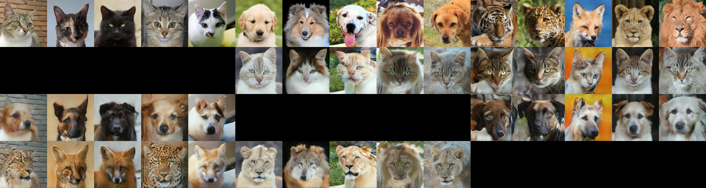

# StarGAN Tutorial Tensorflow 2.3

Unofficial implementation of StarGAN using Tensorflow 2.3.

Original paper: StarGAN: Unified Generative Adversarial Networks for Multi-Domain Image-to-Image Translation

Arxiv: https://arxiv.org/abs/1711.09020

Makes use of an adaptation of [manicman1999's](https://github.com/manicman1999/) data generator.

This implementation makes some deviations from the proposed architecture.  This implemenation includes skip connections in the generator, a multi-task discriminator, and incorporates the label using Adaptive Instance Normalization instead of spatially replicating and concatenating the label.

This implementation also goes hand in hand with a video guide to StarGAN: (April 6, 2021!)

There is also a video that goes through and helps to explain this code: (Release TBD)


## Example Image:
This model was trained on the [Animal Faces HQ dataset](https://github.com/clovaai/stargan-v2/blob/master/README.mdZ) for 177k steps with a batch size of 6, and a channel coefficient of 24.

Rows:
1. Real Images.
2. Converted to Cats.
3. Converted to Dogs.
4. Converted to Wildlife.



## How to Run:
1. Ensure you have created a /data/ folder in the directory with the .py files.
2. Place your class data in individual folders inside of the /data/ folder.
3. Import StarGAN.py and provide the necessary requirements to the constructor!
4. Run the train function for as many steps as you wish to train for.
5. Use the makeImages function to generate translations using test data.
6. Use the translate function to translate manually imported images.

This model has been tested and shows stability for 128x128 input image size, and a channel coefficient of 24.  Beyond that the model may become unstable and lead to collapse.

**An example is provided below.  This can also be found at the bottom of StarGAN.py**

```
#An example of how you could run the model using class folders "/data/classA_folder/", etc image size 256, model name "StarGAN", channel coefficient of 16, and normal size.
if __name__ == "__main__":
    ###Index:      0                1                2
    data = ["classA_folder", "classB_folder", "classC_folder"] #In this case, class A has an index of 0, B 1, C 2.
    testdata = ["classA_testfolder", "classB_testfolder", "classC_testfolder"]
    starGAN = GAN(data, testdata, 256, "StarGAN", 16)
    starGAN.makeImages(-999, 3) #Generates a large image with 3 examples.  Similar to as shown above in the readme.
    starGAN.translate(image_data, 2) #Converts to class C
    starGAN.train(200000)
    exit()
```

**I encourage reading the code!  It has many comments that will help you to understand the inner workings of StarGAN!**

